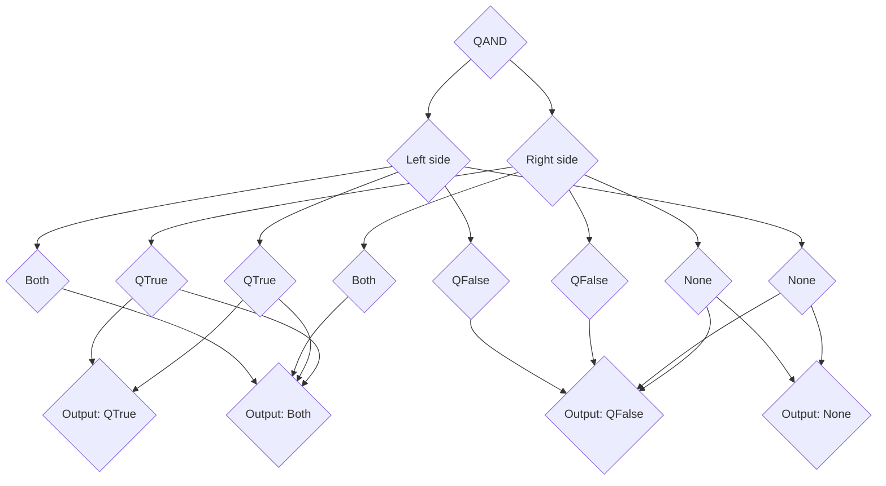
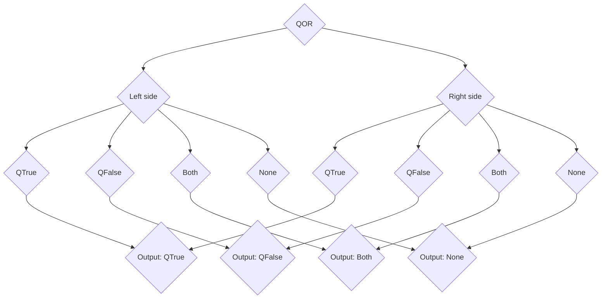
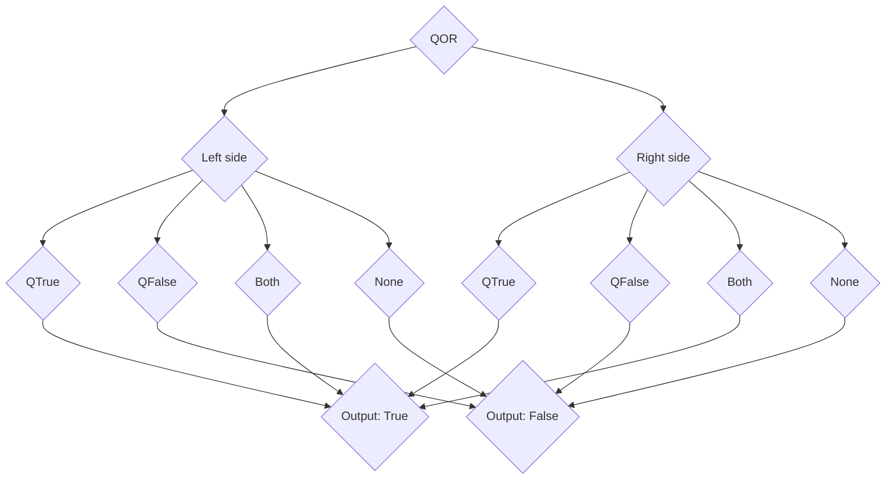

# Features
[Back to home](./docs.md)

### Quantum C currently has the Following features:

Collapse Datatypes table

Datatype|Contains|Advantage|Bonus Features|
--------|-----|---------|--------------|
QBool   |Boolean of 4 states|More flexable than normal bool|8 Logical operators|
Bool    |True or False value|Control flow, single binary bit|Standerd bool with logical operators|
Int     |Whole Number |Any whole number fits in it|All mathmatical operations, including Power|
Float   |32 bit floating point number|Int but has a floating point|Full power of division|
Double|64 bit floating point number|Larger double|More powerfull than a Float|
Char|Single Character|Stores text or a unicode value|Unicode|
String|String of chars|Allows you to store a full string of text|Concentation with +|
Function|Stores a function|Allows for lambda functions|Function|

Collapse Control Flow table

Control Flow type|Used on|Pro|Con|
-----------------|-------|---|---|
If               |Boolean|Any condition works|Only two outcomes, nothing past|
Else             |Boolean|Strengthens If|Only Usefull to increase power of if|
Else If          |Boolean|More conditions to If statment|I mean, the if else pro cons are lazy|
Switch           |Non Collection|Very short equivelant of if else if...|Can easily break code if you forget to type a _break_ statment|
QIf              |QBool  |Quantum Boolean control flow|Limiting to only have a condition on both|
QElse            |QBool  |I mean, its just a else statment on a QIf, no different from else|Same|
QElif            |QBool  |else if but on qbool|Yucky python syntax|
QSwitch          |QBool  |Fixes QIf, runs on all cases|Large syntax|

Operator|Used on|Symbol|Effect|Logic|
--------|-------|------|------|-----------|
Plus    |Number or string|+|Left + right||
Minus   |Number |-|Left - Right||
Times   |Number |*|Left * Right||
Divide  |Number |/|Left / Right||
Modulo  |Number |%|Left % Right||
Power   |Number |**|Left ^ Right||
AND     |Boolean|&&|Left && Right|Left and right are true|
OR      |Boolean|\|\||Left \|\| Right|Left or right are true|
NOT     |Boolean|!|!Bool expresion|Oppsite of expression|
Equal to|Any    |==|Left == Right|left is right|
Not Equal|Any   |!=|Left != Right|left is not right|
QAND    |QBool  |&&&|Left &&& Right|See truth table below|
QOR     |QBool  |\|\|\||Left \|\|\| Right|See truth table below|
QNOT    |QBool  |!!|!! expr|Not + if both none if none both|
QXOR    |QBool  |^^|Left ^^ Right|left \|\|\| right &&& !!(Left &&& right)|
QEQUALS |QBool  |===|Left === Right|If left is right both|
QNOT EQUALS|QBool|!==|Left !== Right|If left is not right both|
Collapse AND|QBool|&\|&|Left &\|& Right|See truth table|
Collapse OR|QBool|\|&\||Left \|&\| Right|See table|

Collapse Truth tables

## Truth Tables:

#### QAND

##### Graph:

##### Truth table:

Left/Right|Both|QTrue|QFalse|None|
----------|----|-----|------|----|
**Both**  |Both|Both |QFalse|QFalse|
**QTrue** |Both|QTrue|QFalse|None|
**QFalse**|QFalse|QFalse|QFalse|QFalse|
**None**  |QFalse|None|QFalse|None|

#### QOR

##### Graph:

##### Truth table:

Left/Right|Both|QTrue|QFalse|None|
----------|----|-----|------|----|
**Both**  |Both|Both |Both  |Both|
**QTrue** |Both|QTrue|QTrue |QTrue|
**QFalse**|Both|QTrue|QFalse|QFalse|
**None**  |Both|QTrue|QFalse|None|

#### Collapse AND

##### Graph:

##### Truth table:

Left/Right|Both|QTrue|QFalse|None|
----------|----|-----|------|----|
**Both**  |True|True |False |False|
**QTrue** |True|True |False |False|
**QFalse**|False|False|False|False|
**None**  |False|False|False|False|

#### Collapse OR

##### Graph:

##### Truth table:

Left/Right|Both|QTrue|QFalse|None|
----------|----|-----|------|----|
**Both**  |True|True |True  |True|
**QTrue** |True|True |True  |True|
**QFalse**|True|True |False |False|
**None**  |True|True |False |False|

### Others

Notation in Syntax section

* A \* after somthing in parenphases means it can be repeated any number of times, and a charecter before a star means that charecter must seperate them
* A ? before parens means it is optional.
* A number after a \* means somthing must be repeted at least number times

Other|Syntax|What for?|
-----|------|---------|
Function|RetType FuncName(?(ArgType ArgName), *) {Code}|Insetad of copy and pasting code, call a function to run a block|
Const|const (rest of var decl)|Making a constant(imutable)Variable, EG const double pi = 3.1415

Collection Types

DataType |Pro|Con|Syntax|Usage|Methods|Properties|
---------|---|---|------|-----|-------|----------|
**Array**|Fixed size|Fixed size|type name[?(amount of elements)]|Fixed size collection of items|N/A|size|
**Grid** |Fixed size|Fixed size|typename[?(amount of elements)]*2|Store a array of arrays|N/A|size|
**Dict/Map**|Non fixed size|Non fixed size|map\<KeyType, ValueType> name|Store key -> value pairs|set(name, value): can also use [name] = value, sets the value stored at name to value, if dosent exist, creates it. remove(key): removes a key if key exists. has(key): returns true if a map has the key, otherwise returns false. keys(): returns an array of all keys in a map.|size|
**List** |Non fixed size|Non fixed size|type[] name|Non fixed size collection of type or array of type or list of type|push(value): pushes value to the top of the list(back). pop(): removes the top(back) item of a list.|size|

# Some are missing from this page