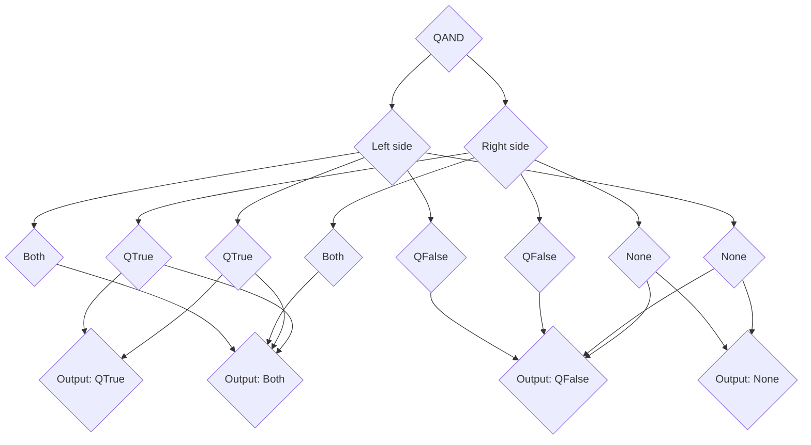
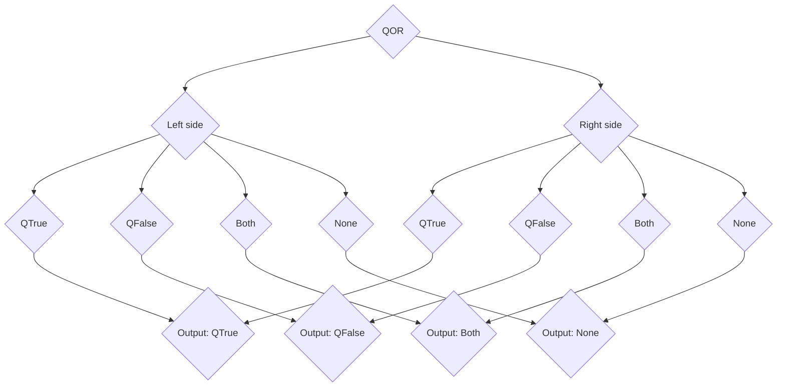
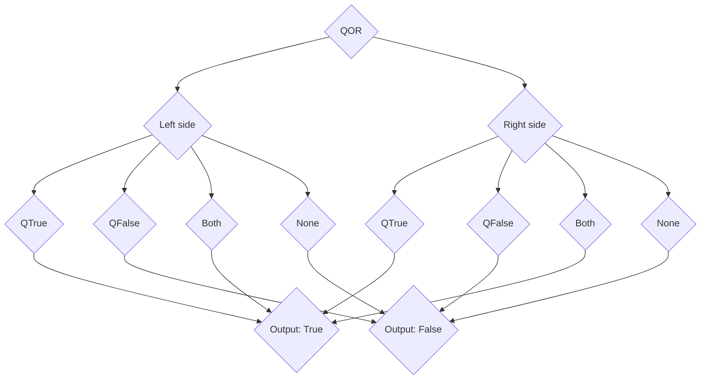

<link rel="stylesheet" href="{{ '/assets/css/main.css' | relative_url }}">

# Features
[Back to home](index.md)

### Quantum C currently has the Following features:

Datatype | Contains                    | Advantage                              | Bonus Features
-------- | --------------------------- | -------------------------------------- | --------------
QBool    | Boolean with 4 states       | More flexible than normal bool         | 8 quantum logical operators
Bool     | True or false value         | Classic control-flow condition         | Standard logical operators
Int      | Whole number                | Any whole integer that fits in range   | All arithmetic ops, including power
Float    | 32-bit floating point       | Fractional numbers                     | Division with fraction support
Double   | 64-bit floating point       | Larger, more precise float             | More precision than float
Char     | Single character            | Stores text or Unicode scalar value    | Unicode support
String   | Sequence of chars           | Full strings of text                   | Concatenation with `+`, f-strings
Function | Callable value (function)   | First-class and lambda functions       | Can be stored in variables, passed around

Control Flow type | Used on | Pro                                      | Con                                  |
----------------- | ------- | ---------------------------------------- | -------------------------------------|
If                | Boolean | Basic conditional                        | Only one condition branch            |
Else              | Boolean | Strengthens `if`                         | Only useful attached to an `if`      |
Else If           | Boolean | More conditions in a chain               | Can become hard to read when overused|
Switch            | Non-collection value | Shorter than if/else-if chains  | Easy to forget `break`           |
QIf               | QBool   | Quantum Boolean control flow             | Mapping gets confusing on 'both'     |
QElse             | QBool   | Else branch for QIf                      | Same as `else`                       |
QElif             | QBool   | Else-if for QIf                          | elif instead of else if              |
QSwitch           | QBool   | Handles all qbool cases cleanly          | Heavier syntax                       |

Operator    | Used on        | Symbol | Effect                 | Logic
----------- | -------------- | ------ | ---------------------- | ----------------------------
Plus        | Number/string  | `+`    | Left + right           |
Minus       | Number         | `-`    | Left - right           |
Times       | Number         | `*`    | Left * right           |
Divide      | Number         | `/`    | Left / right           |
Modulo      | Number         | `%`    | Left % right           |
Power       | Number         | `**`   | Left ^ right (power)   |
AND         | Bool           | `&&`   | Left && right          | Both sides are true
OR          | Bool           | `\|\|` | Left \|\| right        | At least one side true
NOT         | Bool           | `!`    | !expr                  | Opposite of expr
Equal       | Any            | `==`   | Left == right          | Structural equality
Not equal   | Any            | `!=`   | Left != right          | Not equal
QAND        | QBool          | `&&&`  | Left &&& right         | See truth table
QOR         | QBool          | `\|\|\|`| Left \|\|\| right      | See truth table
QNOT        | QBool          | `!!`   | !!expr                 | Quantum not (both/none swap)
QXOR        | QBool          | `^^`   | Left ^^ right          | Left \|\|\| right &&& !!(left &&& right)
QEQUALS     | QBool          | `===`  | Left === right         | If left “equals” right, result both
QNOT EQUALS | QBool          | `!==`  | Left !== right         | If left != right, result both
Collapse AND| QBool          | `&\|&` | Left &\|& right        | See truth table
Collapse OR | QBool          | `\|&\|`| Left \|&\| right       | See truth table

## Truth Tables:

#### QAND

##### Graph:

##### Truth table:

Left/Right|Both|QTrue|QFalse|None|
----------|----|-----|------|----|
**Both**  |Both|Both |QFalse|QFalse|
**QTrue** |Both|QTrue|QFalse|None|
**QFalse**|QFalse|QFalse|QFalse|QFalse|
**None**  |QFalse|None|QFalse|None|

#### QOR

##### Graph:

##### Truth table:

Left/Right|Both|QTrue|QFalse|None|
----------|----|-----|------|----|
**Both**  |Both|Both |Both  |Both|
**QTrue** |Both|QTrue|QTrue |QTrue|
**QFalse**|Both|QTrue|QFalse|QFalse|
**None**  |Both|QTrue|QFalse|None|

#### Collapse AND

##### Graph:

##### Truth table:

Left/Right|Both|QTrue|QFalse|None|
----------|----|-----|------|----|
**Both**  |True|True |False |False|
**QTrue** |True|True |False |False|
**QFalse**|False|False|False|False|
**None**  |False|False|False|False|

#### Collapse OR

##### Graph:

##### Truth table:

Left/Right|Both|QTrue|QFalse|None|
----------|----|-----|------|----|
**Both**  |True|True |True  |True|
**QTrue** |True|True |True  |True|
**QFalse**|True|True |False |False|
**None**  |True|True |False |False|

### Others

Notation used in syntax:

- `*` after something means “repeat zero or more times”.
- A character before `*` means that character separates repeats.  
  Example: `, *` means `a, b, c, ...`.
- `?` before parentheses means the whole group is optional.
- A number after `*` means “at least that many times”.

Other|Syntax|What for?|
-----|------|---------|
Function|RetType FuncName(?(ArgType ArgName), *) {Code}|Insetad of copy and pasting code, call a function to run a block|
Const|const (rest of var decl)|Making a constant(imutable)Variable, EG const double pi = 3.1415
#### Collection Types

DataType |Pro|Con|Syntax|Usage|Methods|Properties|
---------|---|---|------|-----|-------|----------|
**Array**|Fixed size|Fixed size|type name[?(amount of elements)]|Fixed size collection of items|N/A|size|
**Grid** |Fixed size|Fixed size|typename[?(amount of elements)]*2|Store a array of arrays|N/A|size|
**Dict/Map**|Non fixed size|Non fixed size|map\<KeyType, ValueType> name|Store key -> value pairs|set(name, value): can also use [name] = value, sets the value stored at name to value, if dosent exist, creates it. remove(key): removes a key if key exists. has(key): returns true if a map has the key, otherwise returns false. keys(): returns an array of all keys in a map.|size|
**List** |Non fixed size|Non fixed size|type[] name|Non fixed size collection of type or array of type or list of type|push(value): pushes value to the top of the list(back). pop(): removes the top(back) item of a list.|size|

# Some are missing from this page